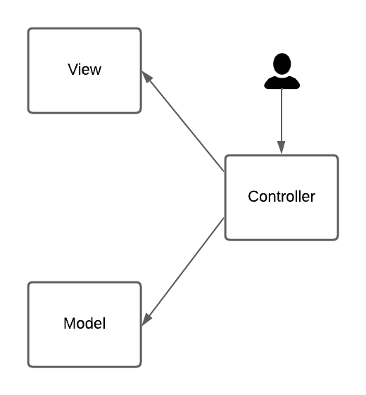
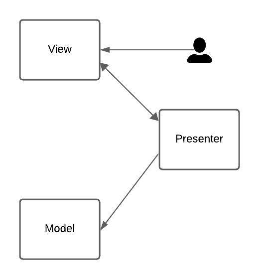
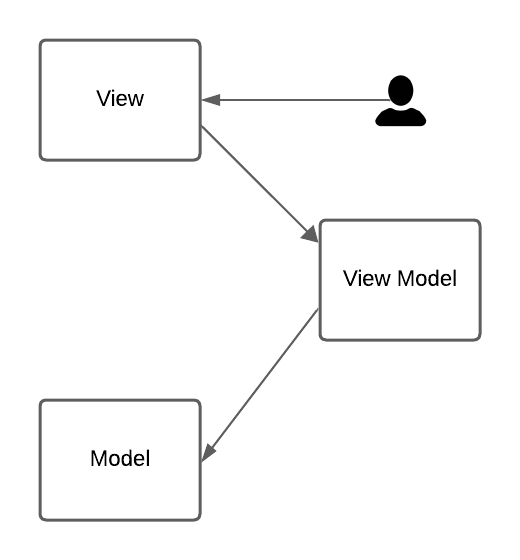

# Model-View-Controller vs Model-View-Presenter vs Model-View-ViewModel

Simple project to compare architectures: MVC, MVP and MVVM.

## MVC - Model-View-Controller

## MVP - Model-View-Presenter

## MVC - Model-View-ViewModel
